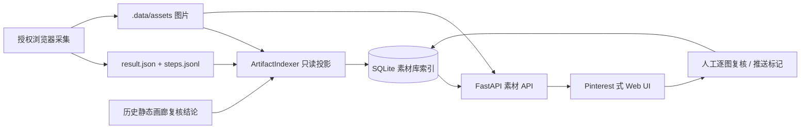

# XVI Pinterest 式素材库设计

## 目标与验收

本地素材库将既有 `.data/artifacts/*/result.json` 与 `.data/assets/*` 投影为可浏览、可筛选、可追溯的网页；不重新访问小红书，不改变已有浏览器采集的授权与安全边界。

| 会议需求 | 当前实现 |
| --- | --- |
| 整篇笔记为展示与推送单位 | 一个卡片对应一个 `note_key`，详情全量平铺该笔记图片 |
| 图片无需跳出即可核验 | 详情页显示全部已采集图片，并可逐图复核 |
| 回到原笔记 | `source_url` 与 `NoteSnapshot` 随每次采集写入 `result.json`，网页提供跳转入口 |
| 标签自主筛选 | 从已采集检索词投影标签；未来 ChinaS/飞书词库可写入相同 `note_tags` 表 |
| 60% 推送规则 | 全部图片已获得有效判断时，符合比例 `>= 0.6` 标为 `eligible` |
| 历史不重复推送 | `delivery_status` 记录 `new/delivered`，可仅看未推送内容 |
| AI 判断可被人复核 | 保留 AI 原始结果、人工结果与 `review_events` 审计轨迹；人工结果优先 |

历史 Artifact 未带 `notes` 的，索引器从 `steps.jsonl` 中同一次 `open_note → capture_note` 的来源 URL 回填。无法恢复 URL 的历史图片仍可浏览，但网页明确显示为不可追溯；未来采集结果不再依赖该兼容逻辑。

## 数据流



## 数据模型

`ingestion_runs` 保留每次 Artifact 的索引状态；`notes` 以去除 URL query 的稳定来源键去重，并保存完整的 `source_url`；`assets` 保存受控的本地文件路径和 AI 判断；`note_tags` 支持从检索词与后续 ChinaS 词库同步的多来源标签；`review_events` 是人工与历史画廊判断的追加审计记录。

SQLite 仅是开发/本地单机事实索引，原始 Artifact 与图片仍是证据源。生产环境应：

1. 将同一 schema 迁移至 PostgreSQL，保留 UUID/稳定来源键与审计表；
2. 将图片迁移至私有对象存储，API 只签发受控预览 URL；
3. 在网关加入企业 SSO、部门角色与操作审计；
4. 将采集 Worker、索引 Worker、API 拆为独立服务，素材导入使用队列；
5. 使用数据库迁移工具管理 schema，不把本地 `.data/library.sqlite3` 带入生产镜像。

## 性能策略

- 笔记级 API 先分页，再在详情按需读取全量图片；缩略图使用浏览器 `loading=lazy`。
- SQLite 使用 WAL，标签和素材路径均有索引；筛选在 SQL 完成，不把 815 张图片预载进前端。
- 瀑布流使用 CSS Columns，无客户端测量、重排库或外部依赖；所有动效遵从 `prefers-reduced-motion`。
- `/api/v1/library/assets/{id}/media` 只可读取数据库登记且位于 `BROWSER_ASSET_ROOT` 下的文件，拒绝路径逃逸。

## 本地运行

```powershell
cd C:\Users\xinli.wang\Documents\Codex\2026-08-03\qing-2\work\xiaohongshu
.\.venv-local\Scripts\python.exe -m uvicorn apps.api.main:app --host 127.0.0.1 --port 8001
```

浏览器访问 `http://127.0.0.1:8001/`。启动时与“同步本地素材”按钮只读取本地 Artifact 和图片，不会执行搜索、登录、点赞、收藏、评论或任何小红书写操作。
